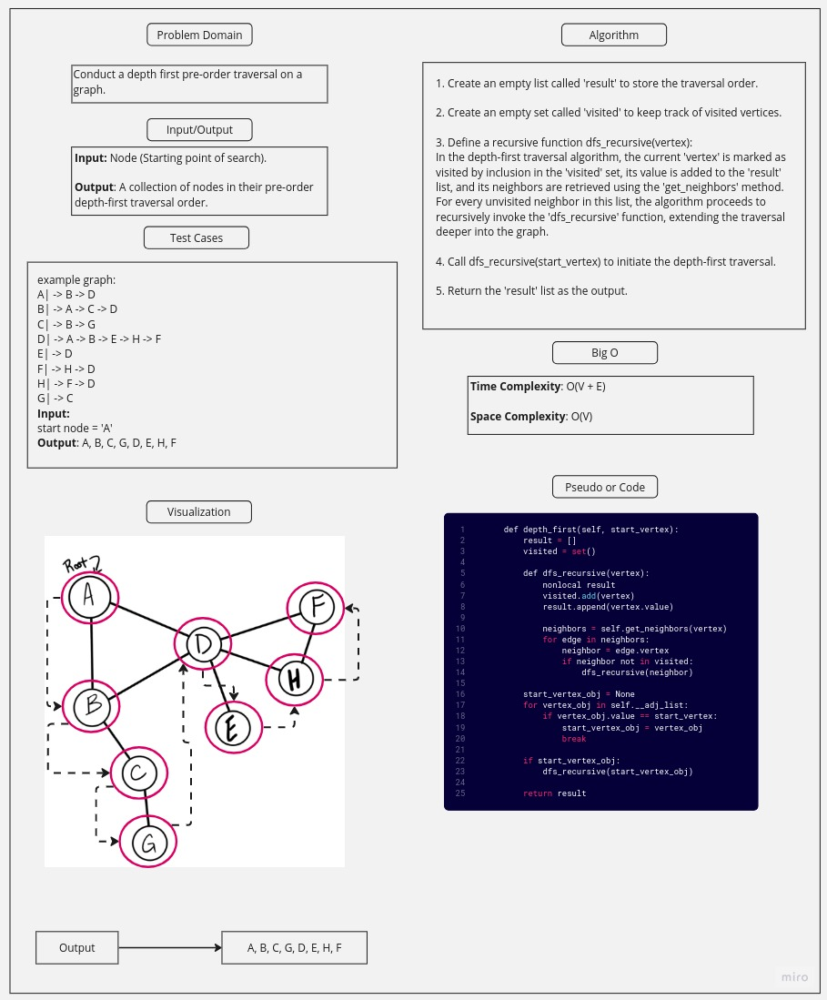

# Challenge Title

#### Conduct a depth first pre-order traversal on a graph

#### Write the following method for the Graph class:

- Name: Depth first
- Arguments: Node (Starting point of search)
- Return: A collection of nodes in their pre-order depth-first traversal order
- Program output: Display the collection

## Whiteboard Process

## Approach & Efficiency

### Approach:

The approach for the depth-first traversal method involves initiating the traversal from a given 'start_vertex'. The algorithm maintains a 'result' list to store the traversal order and a 'visited' set to track visited vertices. It employs a recursive function 'dfs_recursive' to explore the graph's vertices in a depth-first manner. In this function, the current 'vertex' is marked as visited, its value is added to the 'result' list, and its neighbors are retrieved using the 'get_neighbors' method. For each unvisited neighbor, the 'dfs_recursive' function is recursively called, facilitating the traversal's progression through the graph. The final output is the 'result' list containing the vertices in pre-order depth-first traversal order.

### Big O:

- **Time Complexity:** O(V + E)

- **Space Complexity:** O(V)

## Solution

Use pytest to run the tests in the test_graph_depth_first.py file to make sure of the solution.
