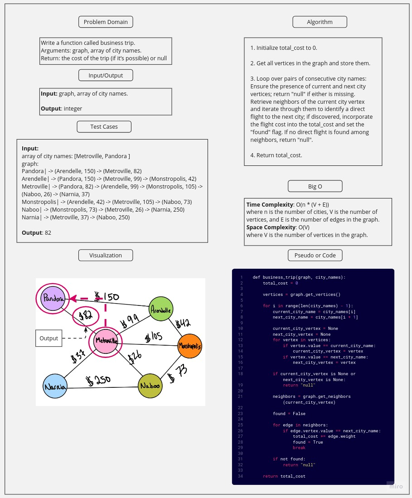

# Challenge Title

Given a business trip itinerary, and an Alaska Airlines route map, is the trip possible with direct flights? If so, how much will the total trip cost be?

- Write a function called business trip
- Arguments: graph, array of city names
- Return: the cost of the trip (if it’s possible) or null (if not)

## Whiteboard Process

## Approach & Efficiency

### Approach:

The approach for the "business_trip" method involves iterating through the list of city names representing the desired order of the trip. For each pair of consecutive city names, the method ensures the presence of their corresponding vertices in the graph; if either vertex is missing, "null" is returned. Then, it retrieves the neighbors of the current city vertex and iterates through them to find a direct flight to the next city. If such a direct flight is found, the cost is added to the total cost, and a "found" flag is set. If no direct flight is found among neighbors, "null" is returned. Overall, the method calculates and returns the total cost of the trip based on direct flights and handles cases where flights are not available or input is insufficient.

### Big O:

#### Time Complexity: O(n \* (V + E))

- where n is the number of cities, V is the number of vertices, and E is the number of edges in the graph.

#### Space Complexity: O(V)

- where V is the number of vertices in the graph.

## Solution

Use pytest to run the tests in the test_graph_business_trip.py file to make sure of the solution.
