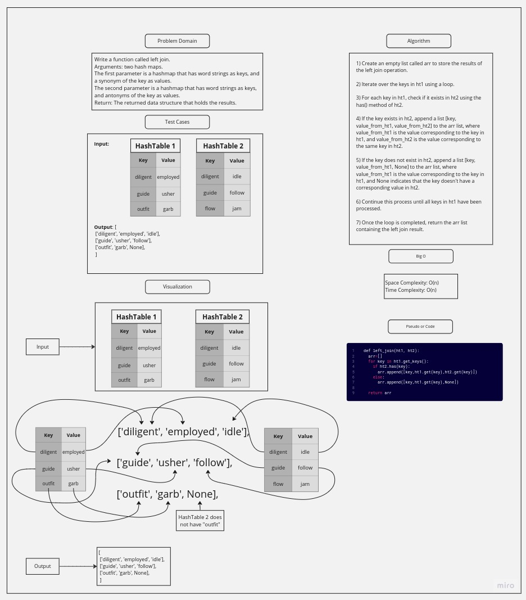

# Challenge Title

Write a function called left join.
Arguments: two hash maps.

- The first parameter: is a hashmap that has word strings as keys, and a synonym of the key as values.
- The second parameter: is a hashmap that has word strings as keys, and antonyms of the key as values.
  Return: The returned data structure that holds the results.

## Whiteboard Process

## Approach & Efficiency

#### **Approach:**

The approach for the left_join() method involves performing a left join operation between two hash tables, ht1 and ht2. To achieve this, we initialize an empty list called arr to store the results. We then iterate over the keys in ht1 using a loop. For each key in ht1, we check if it exists in ht2 using the has() method. If the key exists in ht2, we append a list [key, value_from_ht1, value_from_ht2] to the arr list, where value_from_ht1 is the value corresponding to the key in ht1, and value_from_ht2 is the value corresponding to the same key in ht2. If the key does not exist in ht2, we append a list [key, value_from_ht1, None] to arr, indicating that the key doesn't have a corresponding value in ht2. Finally, we return the arr list containing the left join result, with all key-value pairs from ht1 and, where applicable, the corresponding values from ht2.

#### **Big O:**

- Space Complexity: O(n)
- Time Complexity: O(n)

## Solution

The approach for the left_join() method involves performing a left join operation between two hash tables, ht1 and ht2. To achieve this, we initialize an empty list called arr to store the results. We then iterate over the keys in ht1 using a loop. For each key in ht1, we check if it exists in ht2 using the has() method. If the key exists in ht2, we append a list [key, value_from_ht1, value_from_ht2] to the arr list, where value_from_ht1 is the value corresponding to the key in ht1, and value_from_ht2 is the value corresponding to the same key in ht2. If the key does not exist in ht2, we append a list [key, value_from_ht1, None] to arr, indicating that the key doesn't have a corresponding value in ht2. Finally, we return the arr list containing the left join result, with all key-value pairs from ht1 and, where applicable, the corresponding values from ht2.

**Note: that you can run the tests file using pytest to make sure of the solution.**
