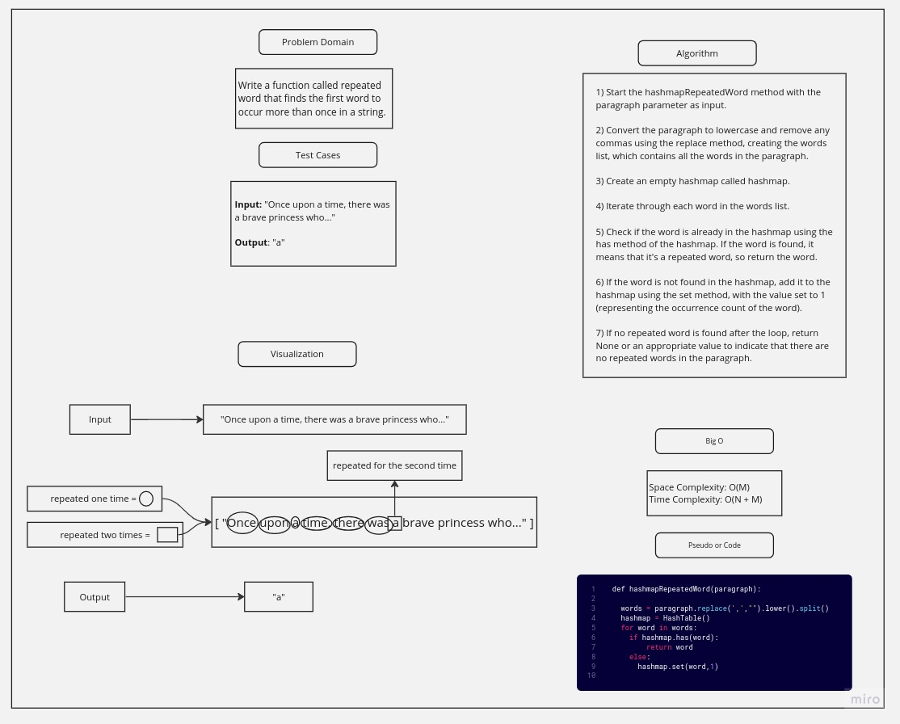

# Challenge Title

- Write a function called repeated word that finds the first word to occur more than once in a string
- Arguments: string
- Return: string

## Whiteboard Process

## Approach & Efficiency

### Approach:

The hashmapRepeatedWord method aims to find the first repeated word in a given paragraph by utilizing a hashmap. The algorithm starts by preprocessing the paragraph, converting it to lowercase, removing commas, and splitting it into individual words. It then initializes an empty hashmap to store unique words and their occurrence count. The algorithm iterates through each word in the words list and checks if it already exists in the hashmap. If the word is found, it indicates a repetition, and the algorithm returns that word as the first repeated word. If the word is not present in the hashmap, it is added to the hashmap with an occurrence count of 1. If no repeated word is found after iterating through all the words, the algorithm returns None, signifying that there are no repeated words in the paragraph. The time complexity of the algorithm is O(N + M), where N is the length of the paragraph and M is the number of words. The space complexity is O(M) due to the storage of unique words and their counts in the hashmap.

### Efficiency:

- Big O:
  - Space Complexity: O(M) - due to the storage of unique words and their counts in the hashmap.
  - Time Complexity: O(N + M) - where N is the length of the paragraph and M is the number of words in the paragraph.

## Solution

This solution defines the hashmapRepeatedWord method, which takes a paragraph as input. The method preprocesses the paragraph by converting it to lowercase, removing commas, and splitting it into individual words. It then uses a custom HashTable class to store unique words as keys and their occurrence count as values. The HashTable class handles collisions by using separate linked lists for each bucket. The hashmapRepeatedWord method iterates through each word in the paragraph and checks if it already exists in the HashTable. If a word is found, it indicates a repetition, and the method returns that word as the first repeated word. If the word is not present in the HashTable, it is added to it with an initial occurrence count of 1. If no repeated word is found after iterating through all the words, the method returns None, indicating that there are no repeated words in the paragraph. The time complexity of the method is O(N + M), where N is the length of the paragraph and M is the number of words. The space complexity is O(M) due to the storage of unique words and their counts in the HashTable.

Note: Use pytest to run the tests in the hashmap_repeated_word_test.py file to make sure of the solution.
