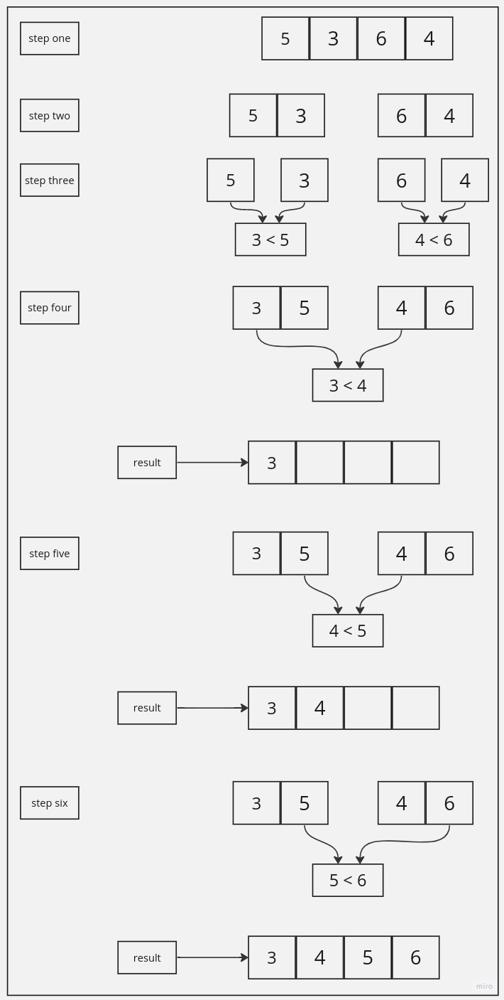

## Merge Sort:

Merge Sort is a divide-and-conquer algorithm that operates by splitting the initial array into progressively smaller segments, sorting each segment autonomously, and subsequently reuniting them to establish a fully sorted array. Initially, the array is recursively divided into halves until these segments reduce to singular elements or become empty. During merging, the elements in these subarrays are compared and orderly positioned. This iterative merging procedure persists until the entire array becomes sorted. The efficiency of Merge Sort, characterized by a time complexity of O(n log n), is particularly advantageous for sorting extensive arrays. Through its strategy of deconstructing the sorting task into more manageable fragments, Merge Sort presents a dependable and effective approach to array sorting.

## Pseudo Code:

../merge/assets/merge_sort.jpg

```
ALGORITHM Mergesort(arr)
    DECLARE n <-- arr.length

    if n > 1
      DECLARE mid <-- n/2
      DECLARE left <-- arr[0...mid]
      DECLARE right <-- arr[mid...n]
      // sort the left side
      Mergesort(left)
      // sort the right side
      Mergesort(right)
      // merge the sorted left and right sides together
      Merge(left, right, arr)

ALGORITHM Merge(left, right, arr)
    DECLARE i <-- 0
    DECLARE j <-- 0
    DECLARE k <-- 0

    while i < left.length && j < right.length
        if left[i] <= right[j]
            arr[k] <-- left[i]
            i <-- i + 1
        else
            arr[k] <-- right[j]
            j <-- j + 1

        k <-- k + 1

    if i = left.length
       set remaining entries in arr to remaining values in right
    else
       set remaining entries in arr to remaining values in left
```

## Trace:

#### Trace Sample Array: [5, 3, 6, 4]



#### Step 1 and 2:

The initial large array is divided into smaller segments to manage its size.

#### Step 3:

For merging, since a single-element array is inherently sorted, merging two such arrays only requires a single comparison step.

#### Steps 4 - 6:

When merging multiple-element sorted arrays, the process starts by selecting the smallest element. This is accomplished by comparing the elements at the first index of both arrays and choosing the smaller value. The index with the smaller element is then incremented until the end of either or both arrays is reached. This process ensures the correct order during merging.

## Approach & Efficiency:

### Approach:

The Merge Sort algorithm uses a divide-and-conquer strategy to sort an array. It starts by dividing the array into smaller halves until they become single elements. Then, it merges these sorted elements back together, creating a fully sorted array. This process reduces sorting complexity to O(n log n) due to efficient divisions. While the recursive calls consume memory (O(n)), the merging step operates in place, optimizing space. This approach offers a dependable and effective way to sort arrays by breaking down the task and utilizing efficient merging techniques.

### Big O:

- **Time Complexity:** O(n log(n))

- **Space Complexity:** O(n)
