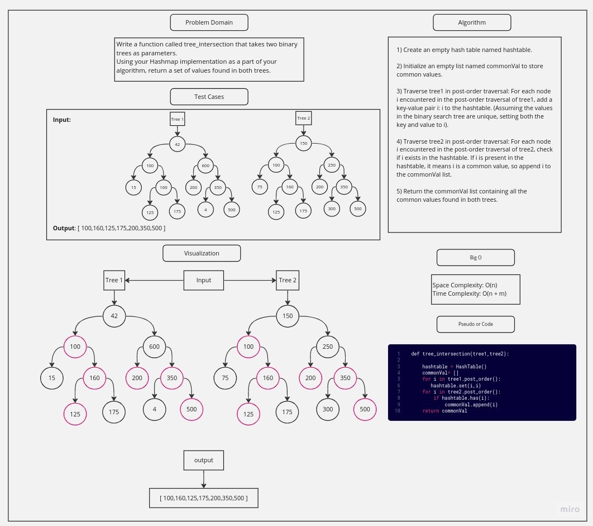

# Challenge Title

Write a function called tree_intersection that takes two binary trees as parameters.
Using your Hashmap implementation as a part of your algorithm, return a set of values found in both trees.

## Whiteboard Process

## Approach & Efficiency

- Approach:

  The tree_intersection method can be summarized as follows: It creates an empty hash table named hashtable and initializes an empty list named commonVal to store common values. It then traverses tree1 in post-order, adding each node's value as a key-value pair to the hash table. In the same way, it traverses tree2 in post-order and checks if each node's value exists in the hash table. If a value is found, it is considered a common value, and it is appended to the commonVal list. Finally, the method returns the commonVal list containing all the common values found in both trees. The time complexity of the method is O(N + M), where N and M are the number of nodes in tree1 and tree2, respectively, and the space complexity is O(N) due to the hash table and the commonVal list.

* Efficiency:
  - Space Complexity: O(n)
  - Time Complexity: O(n + m)

## Solution

The tree_intersection method takes two binary search trees tree1 and tree2 as input and returns a list of common values found in both trees. The method first creates an empty hash table named hashtable. It then initializes an empty list called commonVal to store the common values.

To find common values, the method traverses tree1 in post-order traversal and adds each node's value as a key-value pair to the hashtable. Since the keys in the hash table are unique, setting both the key and value to the node's value is sufficient for comparison.

Next, the method traverses tree2 in post-order traversal. For each node encountered, it checks if the node's value exists in the hashtable. If the value is present in the hashtable, it means it's a common value, so the method appends it to the commonVal list.

Finally, the method returns the commonVal list, containing all the common values found in both trees.
